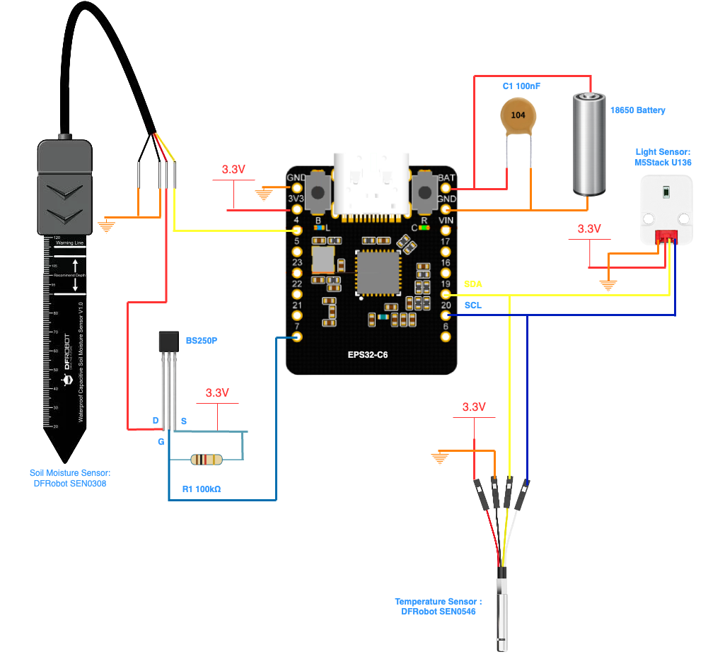
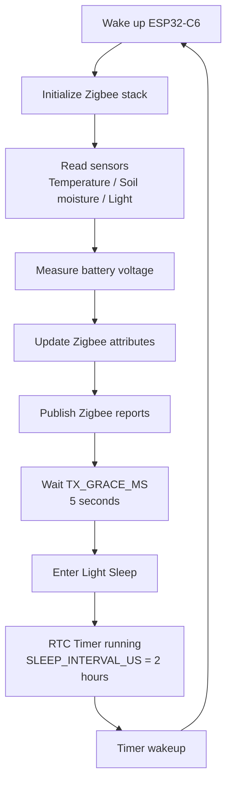

    [](LICENSE) 

# 🌱 ESP32-C6 Zigbee Plant Monitor

This project is a DIY Zigbee sensor designed to monitor the environmental conditions of indoor plants and integrate the data into Home Assistant.

The device collects several measurements:
- Soil moisture using a capacitive soil moisture sensor
- Soil temperature
- Ambient temperature and humidity
- Light exposure

The system is built around a DFRobot Beetle ESP32-C6 Mini and uses Zigbee for wireless communication.

The firmware is developed using the Espressif ESP-IDF framework, allowing native Zigbee support and full control over the ESP32-C6 hardware.

Sensor data is transmitted to Home Assistant where it can be visualized in dashboards to monitor plant conditions and optimize watering schedules.

The components used in this project were mainly parts already available in my stock, but they can easily be replaced by equivalent sensors.

## 🛠️ Hardware

> **Microcontroller:** Beetle ESP32-C6 Mini ([DFRobot DFR1117](https://wiki.dfrobot.com/dfr1117/))
>
> **Soil Moisture Sensor:** Capacitive Soil Moisture Sensor ([DFRobot SEN0308](https://wiki.dfrobot.com/sen0308/))
>
> **Temperature & Humidity Sensor:**  I2C Temperature & Humidity Sensor ([DFRobot SEN0546](https://wiki.dfrobot.com/sen0546/))
>
> **Light Sensor:** digital ambient light detection sensor ([M5Stack U136](https://docs.m5stack.com/en/unit/DLight%20Unit))
>
> **Custom PCB:** A small custom PCB for the ESP32-C6 and sensor connectors
>
> **Enclosure:** 3D-printed case designed to fit all components
---



---

## ✨ Features

- Zigbee communication for easy integration with smart home systems
- Real-time monitoring of plant health parameters
- Designed for indoor plant care and irrigation tracking
- Data visualization and dashboard in Home Assistant

## 🏠 Home Assistant Integration

The sensor data is sent via Zigbee and can be visualized in **Home Assistant** using a dedicated plant monitoring card.

For this project, the dashboard uses Plant Card, a custom Lovelace card designed to monitor and manage multiple plants from a single dashboard view.

- 🌱 Soil moisture (for watering schedule)
- 🌡 Soil temperature
- 💡 Light exposure
- 🔋 Ambient humidity

This makes it easy to track plant conditions and adjust watering schedules directly from Home Assistant.

> The Plant Card Lovelace card is installed via HACS.


## 🚀 Getting Started

1. Flash the firmware to the Beetle ESP32-C6 Mini.
2. Connect the sensors as described in the hardware section.
3. Pair the device with your Zigbee coordinator (e.g., Home Assistant Zigbee integration).
4. Import the dashboard configuration in Home Assistant to visualize your plant data.

## 🧩 3D Printed Enclosure

A custom 3D-printed case is provided to house the ESP32-C6, PCB, and all sensors securely. The design files are available in the repository.

## 🗺️ Roadmap

- [x] Soil moisture monitoring (main branch)
- [x] Soil temperature integration (upcoming branch)
- [x] Light exposure integration (upcoming branch)
- [x] Improved Home Assistant dashboard

---

## 💻 Installation ESP-IDF (macOS)

```bash
xcode-select --install

mkdir -p ~/esp
cd ~/esp
git clone --recursive https://github.com/espressif/esp-idf.git
cd esp-idf
git fetch --tags
git checkout v5.4.1
git submodule update --init --recursive
./install.sh esp32s3
. ./export.sh

idf.py --version
ESP-IDF v5.4.1
```

**🏗️ Project creation + adding the Component zigbee**

```bash

idf.py create-project sensor-plant-zigbee 
cd sensor-plant-zigbee 
idf.py set-target esp32c6

idf.py add-dependency "espressif/esp-zigbee-lib"
idf.py add-dependency "espressif/esp-zboss-lib"

idf.py reconfigure

```


### ⚙️ Enable Zigbee support

Before building the firmware, Zigbee support must be enabled in the project configuration.

Run:
```bash

idf.py menuconfig

```

Navigate to the following menu:
```
Component config → Zigbee
```

Then configure the Zigbee device type:
```
Component config → Zigbee → Configure the Zigbee device type
	•	✅ Choisis Zigbee End Device (ZED) (ou “End device”)

```

This option configures the device as a Zigbee End Device, which is suitable for battery-powered sensors such as plant monitoring probes.

---

## 🛠 Build and Flash the Firmware

he firmware is built using the ESP-IDF. After installing and configuring ESP-IDF, open a terminal in the project directory and compile the firmware with idf.py build. Connect your ESP32-C6 board via USB and flash the firmware using idf.py -p <PORT> flash (for example /dev/ttyUSB0 on Linux or /dev/cu.xxx on Mac). To view logs and debug messages from the device, you can open the serial monitor with idf.py monitor.

```bash
idf.py build
idf.py -p <PORT> flash
idf.py monitor

```

---

## 🔗 Making your sensor recognized in Zigbee2MQTT

When integrating a custom Zigbee device, Zigbee2MQTT may not automatically recognize all its features.
To properly expose your sensor data (humidity, battery, voltage, etc.), you need to provide a device definition.

There are two ways to do this:
	•	🏠 Local method – add a custom device definition directly in your Zigbee2MQTT configuration
	•	🌍 Official method – submit a Pull Request (PR) to the Zigbee2MQTT repository so the device becomes officially supported

In this guide, we will use the local method, which is faster and perfect for DIY devices.

---

In the directory where your Zigbee2MQTT configuration is located, create the following folders:
	•	device_icons → stores the PNG icon used for the device in the UI
	•	external_converters → stores the custom device definition

Your directory structure should look like this:
```
zigbee2mqtt/
 ├── configuration.yaml
 ├── device_icons/
 └── external_converters/

```


**🔍 Retrieve device identification information**

Before creating the device definition, you must retrieve the identification parameters of your sensor.

In Zigbee2MQTT:
	1.	Go to the Devices tab
	2.	Click on your sensor
	3.	Note the following values:

Retrieve the device identification informations :

>Zigbee model (modelID, for example SoilSensor)
>Manufacturer (manufacturerName)

These values will be used to match your device in the custom converter.

---

**🧩 Create a custom device definition**

To allow Zigbee2MQTT to properly interpret your sensor data, you need to create a custom device converter.

Create a new file called:
```bash
sleepyPlantSensor.mjs
```

Place it in the folder:
```bash
external_converters
```


**📄 Example device definition:**

Below is an example converter for a DIY Zigbee soil sensor:
```js
import * as m from 'zigbee-herdsman-converters/lib/modernExtend';

export default {
    fingerprint: [
        {modelID: 'SoilSensor', manufacturerName: 'ECHOME'},
    ],
    zigbeeModel: ['SoilSensor'],
    model: 'SoilSensor',
    vendor: 'ECHOME',
    description: 'DIY Zigbee soil moisture sensor',
    icon: 'device_icons/soilbeetle.png',
    extend: [
        m.battery(),
        m.temperature(),
        m.illuminance(),
        m.humidity(),
    ],
};
```

This file tells Zigbee2MQTT:
	•	how to identify the device
	•	which data to decode
	•	which entities to expose to Home Assistant
	
⚙️ Add the converter to Zigbee2MQTT

Open the Zigbee2MQTT *configuration.yaml* file and add the following entry:
```yaml
external_converters:
  - external_converters/sleepyPlantSensor.mjs
```
Restart Zigbee2MQTT for the changes to take effect.

**🎨 Add a custom device icon**

You can also assign a custom icon to your device.

1️⃣ Place the icon

Add a PNG file inside the device_icons folder:
```bash
device_icons/soilbeetle.png
```


✅ Result

After restarting Zigbee2MQTT:
	•	the sensor will appear correctly recognized
	•	the exposed entities (humidity, battery, etc.) will be available
	•	the device will display a custom icon in Home Assistant

---

## ⚡ Power Management Considerations

Battery-powered Zigbee devices typically use sleep mechanisms to reduce power consumption.  
Two approaches were evaluated during development: **Deep Sleep** and **Light Sleep (Sleepy End Device)**.

Although deep sleep would significantly reduce power consumption, it was not reliable with the ESP Zigbee SDK.

## 😴 Why Deep Sleep Is Not Used

The ESP32-C6 Zigbee stack currently does not handle deep sleep well for Zigbee end devices.

When the device enters deep sleep:

• the Zigbee stack is completely stopped  
• the device loses its active network session  
• the Zigbee connection must be restored after every wake-up  

In practice this causes several issues:

• slow reconnection times  
• unreliable attribute reporting  
• missed Zigbee messages  
• inconsistent behavior in Zigbee2MQTT

Because of this limitation, the sensor uses **Light Sleep instead of Deep Sleep**.

## 🔋 Current Power Strategy

The firmware implements a **Sleepy End Device cycle**:

1. Wake up
2. Read sensors
3. Publish Zigbee attribute reports
4. Wait `TX_GRACE_MS` to ensure radio transmission
5. Enter light sleep
6. Wake up after `SLEEP_INTERVAL_US`

Example configuration:
```c

#define SLEEP_INTERVAL_US           (120ULL * 60ULL * 1000000ULL)
#define TX_GRACE_MS                 5000 //15s

```
This approach keeps the Zigbee session active while still allowing the device to remain in a low-power state for most of the time.

## ⚡ Power Optimization with MOSFET (Soil Sensor Control)

To reduce power consumption and extend battery life, the soil moisture sensor (DFRobot SEN0308) is not powered continuously.

Instead, a P-channel MOSFET (BS250) is used to switch the sensor’s power supply on demand.

The ESP32-C6 controls the MOSFET through a GPIO:
	•	GPIO LOW → MOSFET ON → sensor powered
	•	GPIO HIGH → MOSFET OFF → sensor disconnected

This approach allows the sensor to be powered only during measurement cycles:
	1.	Enable power via MOSFET
	2.	Wait ~300 ms for stabilization
	3.	Read ADC value
	4.	Cut power

This significantly reduces idle current consumption, as the SEN0308 sensor draws current continuously when powered.

---

## 🔄 Device Operation Cycle




---

### 🐞 Problem

While developing a custom Zigbee plant monitoring sensor using an ESP32-C6 and the ESP Zigbee SDK, sensor values were correctly measured and updated inside the device firmware, but Zigbee2MQTT did not update the values automatically.

The device only appeared to update when a manual refresh was triggered from the Zigbee2MQTT UI.

Example behavior:
	•	Sensor values were printed correctly in the device logs.
	•	Zigbee2MQTT showed the correct value only after pressing “refresh”.
	•	Automatic updates never occurred.

Example MQTT payload after a manual refresh:
```json

{
  "battery": 91,
  "humidity": 0,
  "illuminance": 4,
  "linkquality": 160,
  "temperature": 25.14
}

```

**🔍 Root Cause**

The issue was caused by a missing Zigbee binding between the device clusters and the coordinator.

Even though attribute reporting was configured, the Zigbee stack had no destination for the reports, so no automatic updates were sent to the coordinator.

Without binding:
	•	Attributes were updated locally on the device
	•	Zigbee reports were not delivered to the coordinator
	•	Zigbee2MQTT therefore received no updates
	•	The UI refresh triggered a manual read request (ZCL read), which temporarily returned the correct value.

This behavior made it appear as if the device was not reporting values.

**💡 Solution**

The fix was to bind each reportable cluster to the Zigbee coordinator.

Example clusters used in the sensor:
	•	Temperature Measurement
	•	Illuminance Measurement
	•	Relative Humidity Measurement
	•	Power Configuration (battery)

Binding must be performed after the device successfully joins the network.

Example binding logic:
```c
bind_cluster_to_coordinator(ESP_ZB_ZCL_CLUSTER_ID_TEMP_MEASUREMENT);
bind_cluster_to_coordinator(ESP_ZB_ZCL_CLUSTER_ID_ILLUMINANCE_MEASUREMENT);
bind_cluster_to_coordinator(ESP_ZB_ZCL_CLUSTER_ID_REL_HUMIDITY_MEASUREMENT);
bind_cluster_to_coordinator(ESP_ZB_ZCL_CLUSTER_ID_POWER_CONFIG);
```
Once the clusters are bound to the coordinator, attribute reports are correctly delivered and Zigbee2MQTT updates automatically.

Example Zigbee2MQTT log after the fix:
```txt
z2m:mqtt: MQTT publish: topic 'zigbee2mqtt/Dracaena',
payload '{"battery":91,"humidity":0,"illuminance":4,"linkquality":160,"temperature":25.14}'
```

**Key Takeaway**

When using the ESP Zigbee SDK, configuring attribute reporting alone is not sufficient.

A proper APS binding to the coordinator is required for automatic attribute reporting to work correctly.

Without this binding:
	•	Reports have no destination
	•	Zigbee2MQTT will not receive updates
	•	Values will only appear to update when manually queried.


---

## 🔚 Conclusion

This project demonstrates how to build a DIY Zigbee plant monitoring sensor using an ESP32-C6 and integrate it into Home Assistant.  
It allows you to monitor soil moisture, temperature, humidity, and light exposure to better understand your plants' needs and optimize watering.

Feel free to adapt the hardware, improve the firmware, or customize the Home Assistant dashboard for your own setup.

---

## 🚀 Next Steps

The next step for this project is to move toward a more integrated Zigbee device instead of relying on a general-purpose ESP32-C6 board.

While the ESP32-C6 is extremely powerful and flexible, it also introduces several constraints for low-power Zigbee sensors, such as power management complexity, sleep handling, and stack limitations.

A dedicated Zigbee SoC or module would allow a more optimized hardware design, lower power consumption, and a cleaner integration as a true Zigbee end device.

That said, this project has been a very valuable exercise for understanding how the Zigbee stack works on the ESP32-C6, including:
- Zigbee cluster configuration
- attribute reporting and binding
- sleepy end device behavior
- integration with Zigbee2MQTT and Home Assistant

It provided a solid foundation for future Zigbee-based IoT projects.

---

## 📚 References

- [ESP-Zigbee-SDK ](https://github.com/espressif/esp-zigbee-sdk)
- [Plant Card](https://github.com/Kallimeister/plant-card.git)

The environmental thresholds used in this project are inspired by several indoor horticulture guides:

- [Indoor Plant Care](https://www.purdue.edu/hla/sites/yardandgarden/wp-content/uploads/sites/2/2016/10/HO-39.pdf)
- [Light and Moisture Requirements for Indoor Plants](https://sustainablecampus.unimelb.edu.au/__data/assets/pdf_file/0005/2839190/Indoor-plant-workshop-Light-and-Moisture-Requirements.pdf)
- [IoT Solution for Winter Survival of Indoor Plants](https://arxiv.org/abs/2106.05130)
- [Basic Houseplant Care Guide](tagawagardens.com/wp-content/uploads/2022/03/Indoor_Plant_Care.pdf)
- [Paired end device can occasionally not connect coordinator](https://github.com/espressif/esp-zigbee-sdk/issues/465?utm_source=chatgpt.com)
